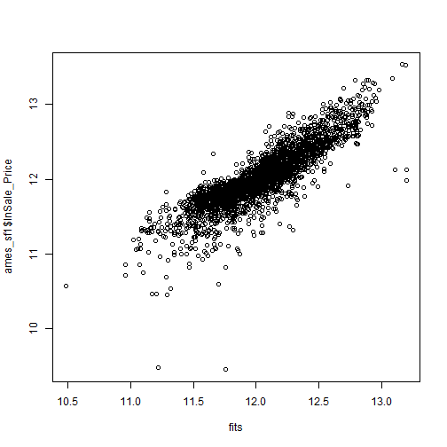
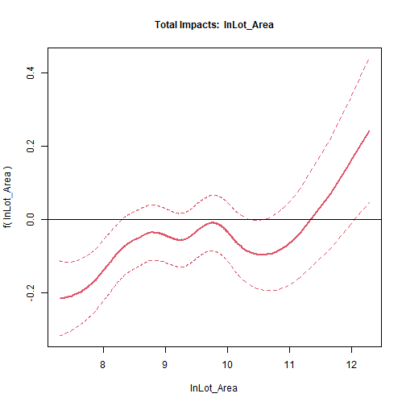
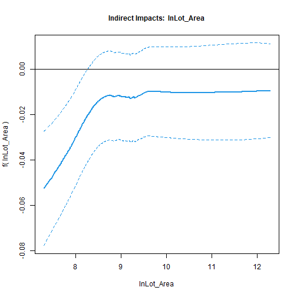
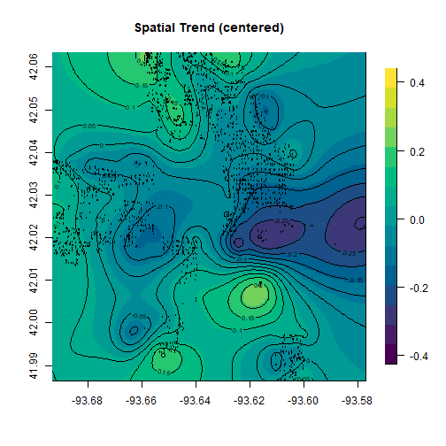
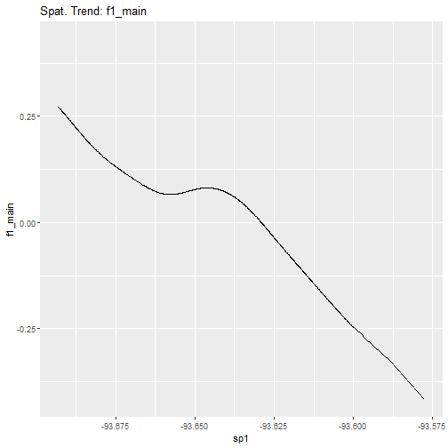

# Models for cross-sectional data

We start our demo with an application of **pspatreg** to the analysis of cross-sectional data. In particular, we use Ames dataset (included in the package **AmesHousing**) which contains data on 2,930 properties in Ames, Iowa. The dataset includes information related to house characteristics (bedrooms, garages, fireplaces, pools, porches, etc.), location characteristics (neighborhood), lot information (zoning, shape, size, etc.), ratings of condition and quality and sale price (from 2006 to 2010). The section is organized as follows:

-   Description of dataset, spatial weights matrix and model specifications;

-   Estimation results of linear spatial models and comparison with the results obtained with the package **spatialreg**;

-   Estimation results of semiparametric spatial models.

## Reading the data

The dataset is a spatial point dataset. It contains  cross-sectional information on 2,930 properties in Ames, Iowa. The raw dataset (`ames`) has been transformed in a spatial point dataset of class `sf` as follows:

```r
library(pspatreg)
library(spdep)
library(sf)
library(ggplot2)
library(dplyr)
ames <- AmesHousing::make_ames()# Raw Ames Housing Data
ames_sf <- st_as_sf(ames, coords = c("Longitude", "Latitude"))
ames_sf$Longitude <- ames$Longitude
ames_sf$Latitude <- ames$Latitude
```
The dependent variable in the regression analysis is *Sale_Price*, while we selected the following variables as covariates:

\- *Lot_Area*: Lot size in square feet

\- *Total_Bsmt_SF*: Total square feet of basement area

\- *Garage_Cars*: Size of garage in car capacity

\- *Gr_Liv_Area*: Above grade (ground) living area square feet

\- *Fireplaces*: Number of fireplaces

Due to the skewed distribution of the dependent variable *Sale_Price*, we use the log-transformation:


```r
ggplot(data = ames_sf) + geom_histogram(mapping = aes(x = Sale_Price))
```


```r
ggplot(data = ames_sf) + geom_histogram(mapping = aes(x = log(Sale_Price)))
```


```r
ames_sf$lnSale_Price <- log(ames_sf$Sale_Price)
ames_sf$lnLot_Area <- log(ames_sf$Lot_Area)
ames_sf$lnTotal_Bsmt_SF <- log(ames_sf$Total_Bsmt_SF+1)
ames_sf$lnGr_Liv_Area <- log(ames_sf$Gr_Liv_Area)
```

## Constructing the spatial weights matrix

Creating spatial weights is a necessary step when using areal data. To do so, it is necessary  to choose a criterion to define the neighbours, and then to assign weights to each of them. 

In particular, we have used a graph-based neighbors list (a Delauney triangulation neighbor list)  after eliminating duplicates in coordinates values (thus the final `sf` object used in the analysis is `ames_sf1`):


```r
ames_sf1 <- ames_sf[duplicated(ames_sf$Longitude) == FALSE,]
coord_sf1 <- cbind(ames_sf1$Longitude, ames_sf1$Latitude)
k5nb <- knn2nb(knearneigh(coord_sf1, k = 5, 
longlat = TRUE, use_kd_tree = FALSE), sym = TRUE)
lw_ames <- nb2listw(k5nb, style = "W", 
zero.policy = FALSE)
```

## Defining *formula* for parametric and semiparametric models

We define different *formula* for linear and nonlinear (semiparametric) models with and without a spatial trend. The Durbin *formula* is used for types "sdm", "slx" or "sdem".

In the case of semiparametric terms, in 3d or in 2d (as it is the case of spatial trend), the number of knots used to construct the B-splines basis needs to be specified.


```r
# Linear Model
formlin <- lnSale_Price ~ lnLot_Area + lnTotal_Bsmt_SF + lnGr_Liv_Area +  Garage_Cars + Fireplaces
durbinformlin <- ~ lnLot_Area + lnTotal_Bsmt_SF + lnGr_Liv_Area + Garage_Cars + Fireplaces
# Semiparametric model without spatial trend
formgam <- lnSale_Price ~ Fireplaces + Garage_Cars + 
  pspl(lnLot_Area, nknots = 20) + 
  pspl(lnTotal_Bsmt_SF, nknots = 20) + 
  pspl(lnGr_Liv_Area, nknots = 20) 
# Semiparametric model with spatial trend in 2d
form2d <- lnSale_Price ~ Fireplaces + Garage_Cars + 
  pspl(lnLot_Area, nknots = 20) + 
  pspl(lnTotal_Bsmt_SF, nknots = 20) +
  pspl(lnGr_Liv_Area, nknots = 20) +
  pspt(Longitude,Latitude, 
       nknots = c(10, 10), 
       psanova = FALSE)
# Semiparametric model with PS-ANOVA spatial trend in 2d
form2d_psanova <- lnSale_Price ~ Fireplaces + Garage_Cars + 
  pspl(lnLot_Area, nknots = 20) + 
  pspl(lnTotal_Bsmt_SF, nknots = 20) + 
  pspl(lnGr_Liv_Area, nknots = 20) +
  pspt(Longitude, Latitude, 
       nknots = c(10, 10), 
       psanova = TRUE)
durbinformnonlin <- ~ Fireplaces + Garage_Cars + 
  pspl(lnLot_Area, nknots = 20)
```

## Estimating parametric linear models

We first estimate standard spatial linear autoregressive models using the function `pspatfit()` included in the package **pspatreg** (based, in the default, on the REML estimators) and compare them with the results obtained using the functions provided by the package **spatialreg** (based on the ML estimators).

### Spatial Lag (SAR) model. REML estimates using `pspatfit()`

The SAR model for cross-sectional data can be specified as:
$$y_{i}=\rho \sum_{j=1}^N w_{ij,N} y_{j} + 
\sum_{k=1}^K \beta_k x_{k,i} + \epsilon_{i}$$

$$\epsilon_{i} \sim i.i.d.(0,\sigma^2_\epsilon)$$
To estimate this model, we use the option `type="sar"`:

```r
linsar <- pspatfit(formlin, data = ames_sf1, listw = lw_ames, method = "Chebyshev", type = "sar")
summary(linsar)
```

```
## 
##  Call 
## pspatfit(formula = formlin, data = ames_sf1, listw = lw_ames, 
##     type = "sar", method = "Chebyshev")
## 
##  Parametric Terms 
##                   Estimate Std. Error t value  Pr(>|t|)    
## (Intercept)     2.4553766  0.0991499 24.7643 < 2.2e-16 ***
## lnLot_Area      0.0296412  0.0071596  4.1401 3.576e-05 ***
## lnTotal_Bsmt_SF 0.0488066  0.0029233 16.6960 < 2.2e-16 ***
## lnGr_Liv_Area   0.3771711  0.0130689 28.8601 < 2.2e-16 ***
## Garage_Cars     0.0942778  0.0051695 18.2374 < 2.2e-16 ***
## Fireplaces      0.0486665  0.0058596  8.3054 < 2.2e-16 ***
## rho             0.5019890  0.0123499 40.6471 < 2.2e-16 ***
## ---
## Signif. codes:  0 '***' 0.001 '**' 0.01 '*' 0.05 '.' 0.1 ' ' 1
## 
##  Goodness-of-Fit 
##  
##  EDF Total:      7 
##  Sigma: 0.201164 
##  AIC:  -6745.73 
##  BIC:  -6704.22
```

All $\beta's$ are significant and positive as expected. The estimated spatial autoregressive (0.50) is also positive and significant.

Extract coefficients:


```r
coef(linsar)
```

```
##             rho     (Intercept)      lnLot_Area lnTotal_Bsmt_SF   lnGr_Liv_Area 
##      0.50198896      2.45537664      0.02964119      0.04880660      0.37717108 
##     Garage_Cars      Fireplaces 
##      0.09427784      0.04866649
```

Extract fitted values and residuals:


```r
fits <- fitted(linsar)
plot(fits, ames_sf1$lnSale_Price)
```



```r
resids <- residuals(linsar)
plot(fits, resids)
```


Extract log-likelihood and restricted log-likelihood:


```r
logLik(linsar)
```

```
## 'log Lik.' 3379.864 (df=7)
```

```r
logLik(linsar, REML = TRUE)
```

```
## 'log Lik.' 3348.361 (df=7)
```

Extract the covariance matrix of estimated coefficients. Argument `bayesian` allows to get frequentist (default) or bayesian covariances:


```r
vcov(linsar)
```

```
##                   (Intercept)    lnLot_Area lnTotal_Bsmt_SF lnGr_Liv_Area
## (Intercept)      9.830695e-03 -3.173257e-04   -3.633123e-05 -9.859045e-04
## lnLot_Area      -3.173257e-04  5.125941e-05    3.099487e-07 -1.935085e-05
## lnTotal_Bsmt_SF -3.633123e-05  3.099487e-07    8.545394e-06 -2.716499e-06
## lnGr_Liv_Area   -9.859045e-04 -1.935085e-05   -2.716499e-06  1.707974e-04
## Garage_Cars      1.931624e-04 -4.065222e-06   -1.994411e-06 -2.592596e-05
## Fireplaces       2.198995e-04 -5.845037e-06   -1.354598e-06 -2.390023e-05
##                   Garage_Cars    Fireplaces
## (Intercept)      1.931624e-04  2.198995e-04
## lnLot_Area      -4.065222e-06 -5.845037e-06
## lnTotal_Bsmt_SF -1.994411e-06 -1.354598e-06
## lnGr_Liv_Area   -2.592596e-05 -2.390023e-05
## Garage_Cars      2.672358e-05 -2.711208e-06
## Fireplaces      -2.711208e-06  3.433484e-05
```

```r
vcov(linsar, bayesian = TRUE)
```

```
##                   (Intercept)    lnLot_Area lnTotal_Bsmt_SF lnGr_Liv_Area
## (Intercept)      9.830695e-03 -3.173257e-04   -3.633123e-05 -9.859045e-04
## lnLot_Area      -3.173257e-04  5.125941e-05    3.099487e-07 -1.935085e-05
## lnTotal_Bsmt_SF -3.633123e-05  3.099487e-07    8.545394e-06 -2.716499e-06
## lnGr_Liv_Area   -9.859045e-04 -1.935085e-05   -2.716499e-06  1.707974e-04
## Garage_Cars      1.931624e-04 -4.065222e-06   -1.994411e-06 -2.592596e-05
## Fireplaces       2.198995e-04 -5.845037e-06   -1.354598e-06 -2.390023e-05
##                   Garage_Cars    Fireplaces
## (Intercept)      1.931624e-04  2.198995e-04
## lnLot_Area      -4.065222e-06 -5.845037e-06
## lnTotal_Bsmt_SF -1.994411e-06 -1.354598e-06
## lnGr_Liv_Area   -2.592596e-05 -2.390023e-05
## Garage_Cars      2.672358e-05 -2.711208e-06
## Fireplaces      -2.711208e-06  3.433484e-05
```

A print method to get printed coefficients, standard errors and p-values of parametric terms:


```r
print(linsar)
```

```
##                 Estimate Std. Error t value Pr(>|t|)
## (Intercept)       2.4554     0.0991 24.7643        0
## lnLot_Area        0.0296     0.0072  4.1401        0
## lnTotal_Bsmt_SF   0.0488     0.0029 16.6960        0
## lnGr_Liv_Area     0.3772     0.0131 28.8601        0
## Garage_Cars       0.0943     0.0052 18.2374        0
## Fireplaces        0.0487     0.0059  8.3054        0
## rho               0.5020     0.0123 40.6471        0
```

Computing average direct, indirect and total marginal impacts:


```r
imp_parvar_sar <- impactspar(linsar, list_varpar)
summary(imp_parvar_sar)
```

```
## 
##  Total Parametric Impacts (sar) 
##                   Estimate Std. Error    t value Pr(>|t|)
## lnLot_Area       0.0603392  0.0147544  4.0895659        0
## lnTotal_Bsmt_SF  0.0977221  0.0061268 15.9499721        0
## lnGr_Liv_Area    0.7584002  0.0328610 23.0790132        0
## Garage_Cars      0.1903382  0.0113532 16.7651239        0
## Fireplaces       0.0972914  0.0121979  7.9761044        0
## 
##  Direct Parametric Impacts (sar) 
##                   Estimate Std. Error    t value Pr(>|t|)
## lnLot_Area       0.0318968  0.0077828  4.0983739        0
## lnTotal_Bsmt_SF  0.0516556  0.0030357 17.0159934        0
## lnGr_Liv_Area    0.4008552  0.0140666 28.4969327        0
## Garage_Cars      0.1006079  0.0055014 18.2876957        0
## Fireplaces       0.0514265  0.0063393  8.1122922        0
## 
##  Indirect Parametric Impacts (sar) 
##                   Estimate Std. Error    t value Pr(>|t|)
## lnLot_Area       0.0284425  0.0070325  4.0444107    1e-04
## lnTotal_Bsmt_SF  0.0460664  0.0034076 13.5187102    0e+00
## lnGr_Liv_Area    0.3575450  0.0214743 16.6499406    0e+00
## Garage_Cars      0.0897303  0.0064723 13.8637705    0e+00
## Fireplaces       0.0458650  0.0060359  7.5987340    0e+00
```

As expected, all marginal impacts are strongly significant and spillover impacts are rather high. We compare these results with those obtained using ML estimates with `lagsarlm()` (package **spatialreg**):


```r
spatregsar <- spatialreg::lagsarlm(formlin, data = ames_sf1, listw = lw_ames, method = "Chebyshev") 
summary(spatregsar)
```

```
## 
## Call:spatialreg::lagsarlm(formula = formlin, data = ames_sf1, listw = lw_ames, 
##     method = "Chebyshev")
## 
## Residuals:
##        Min         1Q     Median         3Q        Max 
## -2.2023877 -0.0829072  0.0089692  0.1009625  0.6366034 
## 
## Type: lag 
## Coefficients: (numerical Hessian approximate standard errors) 
##                  Estimate Std. Error z value  Pr(>|z|)
## (Intercept)     2.4541133  0.1490990 16.4596 < 2.2e-16
## lnLot_Area      0.0296357  0.0071979  4.1172 3.834e-05
## lnTotal_Bsmt_SF 0.0488015  0.0029535 16.5232 < 2.2e-16
## lnGr_Liv_Area   0.3771303  0.0135338 27.8659 < 2.2e-16
## Garage_Cars     0.0942494  0.0057387 16.4235 < 2.2e-16
## Fireplaces      0.0486575  0.0059061  8.2385 2.220e-16
## 
## Rho: 0.50213, LR test value: 1188, p-value: < 2.22e-16
## Approximate (numerical Hessian) standard error: 0.012444
##     z-value: 40.351, p-value: < 2.22e-16
## Wald statistic: 1628.2, p-value: < 2.22e-16
## 
## Log likelihood: 827.9768 for lag model
## ML residual variance (sigma squared): 0.030598, (sigma: 0.17492)
## Number of observations: 2777 
## Number of parameters estimated: 8 
## AIC: -1640, (AIC for lm: -454)
```

```r
W <- as(lw_ames, "CsparseMatrix")
trMatc <- spatialreg::trW(W, type="mult")
set.seed(1)
spatialreg::impacts(spatregsar,listw=lw_ames)
```

```
## Impact measures (lag, exact):
##                     Direct   Indirect      Total
## lnLot_Area      0.03148261 0.02804245 0.05952506
## lnTotal_Bsmt_SF 0.05184279 0.04617784 0.09802063
## lnGr_Liv_Area   0.40063291 0.35685505 0.75748796
## Garage_Cars     0.10012298 0.08918237 0.18930535
## Fireplaces      0.05168978 0.04604155 0.09773133
```

```r
SAR.impact <- spatialreg::impacts(spatregsar, tr = trMatc, R=200)
list_varpar <- as.character(names(summary(linsar)$bfixed[-1]))
imp_parvar <- impactspar(linsar, list_varpar)
summary(imp_parvar)
```

```
## 
##  Total Parametric Impacts (sar) 
##                   Estimate Std. Error    t value Pr(>|t|)
## lnLot_Area       0.0595841  0.0151610  3.9300865    1e-04
## lnTotal_Bsmt_SF  0.0982761  0.0064454 15.2475386    0e+00
## lnGr_Liv_Area    0.7575015  0.0335301 22.5916723    0e+00
## Garage_Cars      0.1893939  0.0111477 16.9895645    0e+00
## Fireplaces       0.0974969  0.0119592  8.1524916    0e+00
## 
##  Direct Parametric Impacts (sar) 
##                   Estimate Std. Error    t value Pr(>|t|)
## lnLot_Area       0.0314798  0.0079766  3.9465284    1e-04
## lnTotal_Bsmt_SF  0.0519197  0.0031587 16.4369388    0e+00
## lnGr_Liv_Area    0.4001559  0.0138391 28.9149462    0e+00
## Garage_Cars      0.1000566  0.0053392 18.7401515    0e+00
## Fireplaces       0.0515116  0.0062225  8.2783461    0e+00
## 
##  Indirect Parametric Impacts (sar) 
##                   Estimate Std. Error    t value Pr(>|t|)
## lnLot_Area       0.0281043  0.0072491  3.8769484    1e-04
## lnTotal_Bsmt_SF  0.0463564  0.0036206 12.8036482    0e+00
## lnGr_Liv_Area    0.3573456  0.0224306 15.9311652    0e+00
## Garage_Cars      0.0893374  0.0064951 13.7545721    0e+00
## Fireplaces       0.0459853  0.0059404  7.7410886    0e+00
```

```r
# Let's compare direct impacts
round(data.frame(spatialreg_dir = summary(SAR.impact, zstats = TRUE, short = TRUE)$res$direct, 
pspatreg_dir = summary(imp_parvar_sar)$dir_table[,1]), 3)
```

```
##                 spatialreg_dir pspatreg_dir
## lnLot_Area               0.031        0.032
## lnTotal_Bsmt_SF          0.052        0.052
## lnGr_Liv_Area            0.401        0.401
## Garage_Cars              0.100        0.101
## Fireplaces               0.052        0.051
```

```r
# Let's compare indirect impacts
round(data.frame(spatialreg_ind = summary(SAR.impact, zstats = TRUE, short = TRUE)$res$indirect, 
pspatreg_ind = summary(imp_parvar_sar)$ind_table[,1]),3)
```

```
##                 spatialreg_ind pspatreg_ind
## lnLot_Area               0.028        0.028
## lnTotal_Bsmt_SF          0.046        0.046
## lnGr_Liv_Area            0.357        0.358
## Garage_Cars              0.089        0.090
## Fireplaces               0.046        0.046
```

```r
# Let's compare total impacts
round(data.frame(spatialreg_tot = summary(SAR.impact, zstats = TRUE, short = TRUE)$res$total, 
pspatreg_tot = summary(imp_parvar_sar)$tot_table[,1]), 3)
```

```
##                 spatialreg_tot pspatreg_tot
## lnLot_Area               0.060        0.060
## lnTotal_Bsmt_SF          0.098        0.098
## lnGr_Liv_Area            0.757        0.758
## Garage_Cars              0.189        0.190
## Fireplaces               0.098        0.097
```

### Spatial Lag in X variables (SLX) model. REML estimates using `pspatfit()`

We now estimate the SLX model that only captures local spatial spillovers through the spatial lags of the explanatory variables:

$$y_{i}= \sum_{k=1}^K \beta_k x_{k,i} +\sum_{k=1}^K \delta_k \sum_{j=1}^N w_{ij,N}x_{k,j}+ \epsilon_{i}$$ 
$$\epsilon_{i} \sim i.i.d.(0,\sigma^2_\epsilon)$$
This model is estimated with the function `pspatfit()` using the option `type = "slx"` and specifying the set of spatial lags through `Durbin = durbinformlin`:


```r
linslx <- pspatfit(formlin, data = ames_sf1, listw = lw_ames, method = "Chebyshev", 
                   type = "slx", Durbin = durbinformlin)
summary(linslx)
```

```
## 
##  Call 
## pspatfit(formula = formlin, data = ames_sf1, listw = lw_ames, 
##     type = "slx", method = "Chebyshev", Durbin = durbinformlin)
## 
##  Parametric Terms 
##                         Estimate Std. Error t value  Pr(>|t|)    
## (Intercept)           7.3856396  0.1837991 40.1832 < 2.2e-16 ***
## lnLot_Area            0.0569806  0.0120583  4.7254 2.411e-06 ***
## lnTotal_Bsmt_SF       0.0510487  0.0033685 15.1548 < 2.2e-16 ***
## lnGr_Liv_Area         0.4213139  0.0166068 25.3700 < 2.2e-16 ***
## Garage_Cars           0.0933193  0.0068160 13.6912 < 2.2e-16 ***
## Fireplaces            0.0569122  0.0069704  8.1648 4.836e-16 ***
## Wlag.lnLot_Area      -0.0296692  0.0153838 -1.9286   0.05388 .  
## Wlag.lnTotal_Bsmt_SF  0.0486076  0.0064998  7.4783 1.005e-13 ***
## Wlag.lnGr_Liv_Area    0.0054634  0.0275963  0.1980   0.84308    
## Wlag.Garage_Cars      0.2214429  0.0105664 20.9572 < 2.2e-16 ***
## Wlag.Fireplaces       0.0491468  0.0123350  3.9843 6.942e-05 ***
## ---
## Signif. codes:  0 '***' 0.001 '**' 0.01 '*' 0.05 '.' 0.1 ' ' 1
## 
##  Goodness-of-Fit 
##  
##  EDF Total:     11 
##  Sigma: 0.194399 
##  AIC:  -6308.59 
##  BIC:  -6243.37
```

Now we compute impacts for the SLX model. In this case, contrary to the case of the SAR and SDM models, we do not need simulations to make inference on these marginal impacts. We only need to properly compute the variance of total impact using this formula:  

$$ Var(\hat{\beta_k})\_{tot} = Var(\hat{\beta_k}) + Var(\hat{\delta_k}) + 2* Cov(\hat{\beta_k}, \hat{\delta_k}) $$


```r
imp_parvar_slx <- impactspar(linslx, listw = lw_ames)
summary(imp_parvar_slx)
```

```
## 
##  Parametric Impacts (slx) 
##                  Direct  Indirect   Total
## lnLot_Area      0.05698 -0.029669 0.02731
## lnTotal_Bsmt_SF 0.05105  0.048608 0.09966
## lnGr_Liv_Area   0.42131  0.005463 0.42678
## Garage_Cars     0.09332  0.221443 0.31476
## Fireplaces      0.05691  0.049147 0.10606
## 
##  Standard errors: 
##                   Direct Indirect    Total
## lnLot_Area      0.012058  0.01538 0.010220
## lnTotal_Bsmt_SF 0.003368  0.00650 0.006533
## lnGr_Liv_Area   0.016607  0.02760 0.025436
## Garage_Cars     0.006816  0.01057 0.009474
## Fireplaces      0.006970  0.01234 0.011952
## 
##  Z-values: 
##                 Direct Indirect  Total
## lnLot_Area       4.725   -1.929  2.672
## lnTotal_Bsmt_SF 15.155    7.478 15.254
## lnGr_Liv_Area   25.370    0.198 16.779
## Garage_Cars     13.691   20.957 33.224
## Fireplaces       8.165    3.984  8.873
## 
##  p-values: 
##                     Direct  Indirect      Total
## lnLot_Area       1.148e-06 2.689e-02  3.766e-03
## lnTotal_Bsmt_SF  3.520e-52 3.765e-14  7.707e-53
## lnGr_Liv_Area   2.707e-142 4.215e-01  1.746e-63
## Garage_Cars      5.729e-43 8.064e-98 2.387e-242
## Fireplaces       1.609e-16 3.384e-05  3.546e-19
```

We compare the non-nested models `linsar` and `linslx` using the function `anova()` with the argument `lrtest = FALSE`:


```r
anova(linsar, linslx, lrtest = FALSE)
```

```
##        logLik rlogLik edf     AIC     BIC
## linsar 3379.9  3348.4   7 -6745.7 -6641.2
## linslx 3165.3  3112.4  11 -6308.6 -6137.6
```

It emerges that, from a statistical point of view, the SAR model outperforms the SLX model, suggesting a global spatial diffusion of idiosyncratic shocks. 
### Spatial Durbin model (SDM). REML estimates using the function `pspatfit()`:

The SDM specification encompasses both SAR and SLX:
$$y_{i}=\rho \sum_{j=1}^N w_{ij,N} y_{j} + 
\sum_{k=1}^K \beta_k x_{k,i} +\sum_{k=1}^K \delta_k \sum_{j=1}^N w_{ij,N}x_{k,j}+ \epsilon_{i}$$ 

$$\epsilon_{i} \sim i.i.d.(0,\sigma^2_\epsilon)$$

We can estimate this model using the option `type = "sdm"`:

```r
linsdm <- pspatfit(formlin, data = ames_sf1, listw = lw_ames, method = "Chebyshev", type = "sdm")
summary(linsdm)
```

```
## 
##  Call 
## pspatfit(formula = formlin, data = ames_sf1, listw = lw_ames, 
##     type = "sdm", method = "Chebyshev")
## 
##  Parametric Terms 
##                          Estimate  Std. Error t value  Pr(>|t|)    
## (Intercept)           3.48284130  0.16099537 21.6332 < 2.2e-16 ***
## lnLot_Area            0.06441273  0.01056220  6.0984 1.221e-09 ***
## lnTotal_Bsmt_SF       0.04693907  0.00295056 15.9085 < 2.2e-16 ***
## lnGr_Liv_Area         0.42222987  0.01454642 29.0264 < 2.2e-16 ***
## Garage_Cars           0.07556228  0.00597034 12.6563 < 2.2e-16 ***
## Fireplaces            0.05336680  0.00610560  8.7406 < 2.2e-16 ***
## Wlag.lnLot_Area      -0.05392100  0.01347518 -4.0015 6.459e-05 ***
## Wlag.lnTotal_Bsmt_SF  0.00249245  0.00569340  0.4378    0.6616    
## Wlag.lnGr_Liv_Area   -0.22537060  0.02417242 -9.3235 < 2.2e-16 ***
## Wlag.Garage_Cars      0.07060964  0.00925547  7.6290 3.234e-14 ***
## Wlag.Fireplaces       0.00094332  0.01080462  0.0873    0.9304    
## rho                   0.53162378  0.01885843 28.1902 < 2.2e-16 ***
## ---
## Signif. codes:  0 '***' 0.001 '**' 0.01 '*' 0.05 '.' 0.1 ' ' 1
## 
##  Goodness-of-Fit 
##  
##  EDF Total:     12 
##  Sigma: 0.19138 
##  AIC:  -6876.84 
##  BIC:  -6805.69
```

LR test for nested models and ANOVA tables:


```r
anova(linsar, linsdm, lrtest = TRUE)
```

```
##        logLik rlogLik edf     AIC     BIC LRtest      p.val
## linsar 3379.9  3348.4   7 -6745.7 -6641.2                  
## linsdm 3450.4  3396.1  12 -6876.8 -6697.0 95.378 4.9718e-19
```

```r
anova(linslx, linsdm, lrtest = TRUE)
```

```
##        logLik rlogLik edf     AIC     BIC LRtest       p.val
## linslx 3165.3  3112.4  11 -6308.6 -6137.6                   
## linsdm 3450.4  3396.1  12 -6876.8 -6697.0 567.33 2.1356e-125
```

The LR test suggests that the parametric SDM model outperforms both SAR and SLX.

Computing average direct and indirect marginal impacts:


```r
imp_parvar_sdm <- impactspar(linsdm, list_varpar)
summary(imp_parvar_sdm)
```

```
## 
##  Total Parametric Impacts (sdm) 
##                  Estimate Std. Error   t value Pr(>|t|)
## lnLot_Area       0.021786   0.018905  1.152390   0.2492
## lnTotal_Bsmt_SF  0.105232   0.013030  8.076156   0.0000
## lnGr_Liv_Area    0.420711   0.051670  8.142201   0.0000
## Garage_Cars      0.313152   0.021252 14.734877   0.0000
## Fireplaces       0.116144   0.022183  5.235756   0.0000
## 
##  Direct Parametric Impacts (sdm) 
##                   Estimate Std. Error    t value Pr(>|t|)
## lnLot_Area       0.0616806  0.0100025  6.1665194        0
## lnTotal_Bsmt_SF  0.0507975  0.0031061 16.3541364        0
## lnGr_Liv_Area    0.4219978  0.0151317 27.8882925        0
## Garage_Cars      0.0908073  0.0058678 15.4755882        0
## Fireplaces       0.0574439  0.0060243  9.5352930        0
## 
##  Indirect Parametric Impacts (sdm) 
##                   Estimate Std. Error    t value Pr(>|t|)
## lnLot_Area      -0.0398949  0.0201787 -1.9770854   0.0480
## lnTotal_Bsmt_SF  0.0544342  0.0117285  4.6411888   0.0000
## lnGr_Liv_Area   -0.0012865  0.0476483 -0.0270002   0.9785
## Garage_Cars      0.2223442  0.0199714 11.1331283   0.0000
## Fireplaces       0.0586997  0.0204267  2.8736790   0.0041
```


### Spatial Error model (SEM). REML estimates using `pspatfit()`

The last parametric specification considered here is the SEM. This model that spatial spillovers occurs only for the unobserved random shocks:  

$$y_{i}=\sum_{k=1}^K \beta_k x_{k,i} + \epsilon_{i}$$ $$\epsilon_{i}=\theta \sum_{j=1}^N w_{ij,N}\epsilon_{j}+u_{i}$$ $$u_{i} \sim i.i.d.(0,\sigma^2_u)$$
We estimate this model using the option `type = "sem"`:

```r
linsem <- pspatfit(formlin, data = ames_sf1, listw = lw_ames, method = "Chebyshev", type = "sem")
summary(linsem)
```

```
## 
##  Call 
## pspatfit(formula = formlin, data = ames_sf1, listw = lw_ames, 
##     type = "sem", method = "Chebyshev")
## 
##  Parametric Terms 
##                   Estimate Std. Error t value  Pr(>|t|)    
## (Intercept)     7.6504011  0.1236671 61.8629 < 2.2e-16 ***
## lnLot_Area      0.0695244  0.0103835  6.6957  2.59e-11 ***
## lnTotal_Bsmt_SF 0.0461689  0.0029934 15.4237 < 2.2e-16 ***
## lnGr_Liv_Area   0.4482457  0.0147628 30.3632 < 2.2e-16 ***
## Garage_Cars     0.0799115  0.0060501 13.2082 < 2.2e-16 ***
## Fireplaces      0.0552622  0.0062206  8.8838 < 2.2e-16 ***
## delta           0.7191707  0.0133720 53.7818 < 2.2e-16 ***
## ---
## Signif. codes:  0 '***' 0.001 '**' 0.01 '*' 0.05 '.' 0.1 ' ' 1
## 
##  Goodness-of-Fit 
##  
##  EDF Total:      7 
##  Sigma: 0.250831 
##  AIC:  -6557.27 
##  BIC:  -6515.76
```

```r
anova(linsem,linsdm, lrtest = TRUE)
```

```
##        logLik rlogLik edf     AIC     BIC LRtest      p.val
## linsem 3285.6  3256.3   7 -6557.3 -6457.1                  
## linsdm 3450.4  3396.1  12 -6876.8 -6697.0 279.51 2.5309e-58
```

The spatial spillover parameter $\delta$ is rather high (0.72) and statistically significant. As well known,  the SEM is also nested in the SDM, so we can use a LR test to compare the two models. The results suggest again that the SDM is the best parametric specification.

Comparing the results with those obtained using ML estimates with `errorsarlm()` function of package **spatialreg**:


```r
spatregsem <- spatialreg::errorsarlm(formlin, data = ames_sf1, listw = lw_ames, method = "Chebyshev") 
summary(spatregsem)
```

```
## 
## Call:
## spatialreg::errorsarlm(formula = formlin, data = ames_sf1, listw = lw_ames, 
##     method = "Chebyshev")
## 
## Residuals:
##       Min        1Q    Median        3Q       Max 
## -2.133698 -0.075264  0.012562  0.092108  0.739430 
## 
## Type: error 
## Coefficients: (asymptotic standard errors) 
##                  Estimate Std. Error z value  Pr(>|z|)
## (Intercept)     7.6503768  0.1233360 62.0287 < 2.2e-16
## lnLot_Area      0.0695242  0.0103557  6.7136 1.899e-11
## lnTotal_Bsmt_SF 0.0461693  0.0029854 15.4652 < 2.2e-16
## lnGr_Liv_Area   0.4482483  0.0147233 30.4448 < 2.2e-16
## Garage_Cars     0.0799138  0.0060340 13.2440 < 2.2e-16
## Fireplaces      0.0552629  0.0062040  8.9077 < 2.2e-16
## 
## Lambda: 0.71915, LR test value: 999.53, p-value: < 2.22e-16
## Approximate (numerical Hessian) standard error: 0.013833
##     z-value: 51.988, p-value: < 2.22e-16
## Wald statistic: 2702.8, p-value: < 2.22e-16
## 
## Log likelihood: 733.7619 for error model
## ML residual variance (sigma squared): 0.030231, (sigma: 0.17387)
## Number of observations: 2777 
## Number of parameters estimated: 8 
## AIC: -1451.5, (AIC for lm: -454)
```

```r
spatialreg::Hausman.test(spatregsem)# Test OLS vs. SEM
```

```
## 
## 	Spatial Hausman test (approximate)
## 
## data:  NULL
## Hausman test = 213.49, df = 6, p-value < 2.2e-16
```

```r
round(data.frame(linsem = summary(linsem)$bfixed, spatregsem = summary(spatregsem)$coefficients), 3)
```

```
##                 linsem spatregsem
## (Intercept)      7.650      7.650
## lnLot_Area       0.070      0.070
## lnTotal_Bsmt_SF  0.046      0.046
## lnGr_Liv_Area    0.448      0.448
## Garage_Cars      0.080      0.080
## Fireplaces       0.055      0.055
```

## Estimating semiparametric nonlinear models with and without a spatial trend

We now provide examples of the estimation of semiparametric models. Let's start with a simple semiparametric model without spatial trends and without spatially lagged terms: $$y_{i}=\sum_{k=1}^K \beta^*_k x^*_{k,it} +\sum_{\delta=1}^\Delta g_\delta(x_{\delta, it}) + \epsilon_{i}$$

$$\epsilon_{i}\sim i.i.d.(0,\sigma^2_\epsilon)$$
In particular, we introduce the discrete variables *Fireplaces* and *Garage_Cars* as linear terms and the continuous variables *lnLot_Area*, *lnTotal_Bsmt_SF*, and *lnGr_Liv_Area* as smooth terms, using the function `pspl()` with 20 knots:  


```r
formgam <- lnSale_Price ~ Fireplaces + Garage_Cars +
  pspl(lnLot_Area, nknots = 20) + 
  pspl(lnTotal_Bsmt_SF, nknots = 20) +
  pspl(lnGr_Liv_Area, nknots = 20) 
```


```r
gam <- pspatfit(formgam, data = ames_sf1)
summary(gam)
```

```
## 
##  Call 
## pspatfit(formula = formgam, data = ames_sf1)
## 
##  Parametric Terms 
##                                         Estimate Std. Error t value Pr(>|t|)    
## (Intercept)                          11.3491400  0.2539552 44.6895   <2e-16 ***
## Fireplaces                            0.0709486  0.0069692 10.1803   <2e-16 ***
## Garage_Cars                           0.1578024  0.0063802 24.7332   <2e-16 ***
## pspl(lnLot_Area, nknots = 20).1      -0.2743330  0.2469516 -1.1109   0.2667    
## pspl(lnTotal_Bsmt_SF, nknots = 20).1 -0.8790673  0.8920559 -0.9854   0.3245    
## pspl(lnGr_Liv_Area, nknots = 20).1   -0.7531665  0.5573690 -1.3513   0.1767    
## ---
## Signif. codes:  0 '***' 0.001 '**' 0.01 '*' 0.05 '.' 0.1 ' ' 1
## 
##  Non-Parametric Terms 
##                                         EDF
## pspl(lnLot_Area, nknots = 20)      11.4625
## pspl(lnTotal_Bsmt_SF, nknots = 20)  6.5728
## pspl(lnGr_Liv_Area, nknots = 20)   13.0650
## 
##  Goodness-of-Fit 
##  
##  EDF Total: 37.1002 
##  Sigma: 0.229299 
##  AIC:  -5877.13 
##  BIC:  -5657.16
```

The EDF numbers clearly suggest that the three continuout variables enter the model nonlinearly.

Now, we introduce the spatial lag of the dependent variable, thus specifying a semiparametric SAR model: $$y_{i}=\rho \sum_{j=1}^N w_{ij,N} y_{j} +\sum_{k=1}^K \beta^*_k x^*_{k,i} +
\sum_{\delta=1}^\Delta g_\delta(x_{\delta, i}) +\epsilon_{i}$$
$$\epsilon_{i}\sim i.i.d.(0,\sigma^2_\epsilon)$$


```r
gamsar <- pspatfit(formgam, data = ames_sf1, listw = lw_ames, method = "Chebyshev", type = "sar")
summary(gamsar)
```

```
## 
##  Call 
## pspatfit(formula = formgam, data = ames_sf1, listw = lw_ames, 
##     type = "sar", method = "Chebyshev")
## 
##  Parametric Terms 
##                                         Estimate Std. Error t value  Pr(>|t|)    
## (Intercept)                           5.9825533  0.0995417 60.1010 < 2.2e-16 ***
## Fireplaces                            0.0469759  0.0056778  8.2737 < 2.2e-16 ***
## Garage_Cars                           0.0857818  0.0051870 16.5377 < 2.2e-16 ***
## pspl(lnLot_Area, nknots = 20).1      -0.3165034  0.1661093 -1.9054  0.056833 .  
## pspl(lnTotal_Bsmt_SF, nknots = 20).1 -1.0126713  0.3090082 -3.2772  0.001062 ** 
## pspl(lnGr_Liv_Area, nknots = 20).1   -0.2336450  0.3900975 -0.5989  0.549262    
## rho                                   0.4643733  0.0125969 36.8640 < 2.2e-16 ***
## ---
## Signif. codes:  0 '***' 0.001 '**' 0.01 '*' 0.05 '.' 0.1 ' ' 1
## 
##  Non-Parametric Terms 
##                                         EDF
## pspl(lnLot_Area, nknots = 20)       7.8270
## pspl(lnTotal_Bsmt_SF, nknots = 20)  4.6303
## pspl(lnGr_Liv_Area, nknots = 20)   12.8040
## 
##  Goodness-of-Fit 
##  
##  EDF Total: 32.2613 
##  Sigma: 0.241385 
##  AIC:  -6919.01 
##  BIC:  -6727.73
```

```r
anova(linsar, gamsar, lrtest = TRUE)
```

```
##        logLik rlogLik    edf     AIC     BIC LRtest     p.val
## linsar 3379.9  3348.4  7.000 -6745.7 -6641.2                 
## gamsar 3491.8  3474.6 32.261 -6919.0 -6693.8 252.51 2.346e-39
```

The spatial spillover parameter is now 0.46, a bit lower than the one estimated with the linear SAR (0.50) and SDM (0.53), confirming the trade off between nonlinearities and spatial dependence [@basdurminmonmur14]. The log-likelihood of the semiparametric SAR is higher than that of the linear SAR, and the LR test also suggests that this difference is statistically significant (notice that the linear SAR model is nested in the semiparametric SAR). Moreover, the AIC value of the semiparametric model is lower than that of the linear SAR, confirming that the goodness of fit of the semiparametric model is higher that that of the linear model. However, the BIC value works in favor of the linear specification. This is because the BIC  penalizes more strongly more complex models than the AIC.

Let's now introduce also a spatial trend 2d (without the ANOVA decomposition) in order to control for unobserved spatial heterogeneity: 

$$y_{i}=\rho \sum_{j=1}^N w_{ij,N} y_{j}+
\sum_{k=1}^K \beta^*_k x^*_{k,i} +
\sum_{\delta=1}^\Delta g_\delta(x_{\delta, i}) +
\widetilde{ f}(s_{1i},s_{2i})+\epsilon_{i}$$

$$\epsilon_{i}\sim i.i.d.(0,\sigma^2_\epsilon)$$
To speed up the computational time, we compute the spatial Jacobian using the Chebyshev transformation.


```r
sp2dsar <- pspatfit(form2d, data = ames_sf1, listw = lw_ames, method = "Chebyshev", type = "sar")
summary(sp2dsar)
```

```
## 
##  Call 
## pspatfit(formula = form2d, data = ames_sf1, listw = lw_ames, 
##     type = "sar", method = "Chebyshev")
## 
##  Parametric Terms 
##                                         Estimate Std. Error t value  Pr(>|t|)    
## (Intercept)                           8.1646910  0.1417263 57.6088 < 2.2e-16 ***
## Fireplaces                            0.0555328  0.0058079  9.5617 < 2.2e-16 ***
## Garage_Cars                           0.0652675  0.0056843 11.4820 < 2.2e-16 ***
## Xspt.2                               -1.4680803  2.0524090 -0.7153  0.474488    
## Xspt.3                               -1.0130739  2.0551970 -0.4929  0.622100    
## Xspt.4                               -1.4227789  2.7715586 -0.5133  0.607749    
## pspl(lnLot_Area, nknots = 20).1      -0.5300087  0.1643346 -3.2252  0.001274 ** 
## pspl(lnTotal_Bsmt_SF, nknots = 20).1 -1.0325819  0.2218681 -4.6540 3.412e-06 ***
## pspl(lnGr_Liv_Area, nknots = 20).1   -0.4111963  0.3758808 -1.0940  0.274073    
## rho                                   0.2889968  0.0176792 16.3467 < 2.2e-16 ***
## ---
## Signif. codes:  0 '***' 0.001 '**' 0.01 '*' 0.05 '.' 0.1 ' ' 1
## 
##  Non-Parametric Terms 
##                                         EDF
## pspl(lnLot_Area, nknots = 20)       6.4063
## pspl(lnTotal_Bsmt_SF, nknots = 20)  3.4493
## pspl(lnGr_Liv_Area, nknots = 20)   13.3106
## 
##  Non-Parametric Spatio-Temporal Trend 
##                EDF
## f(sp1, sp2) 41.105
## 
##  Goodness-of-Fit 
##  
##  EDF Total: 74.2712 
##  Sigma: 0.188421 
##  AIC:  -7010.75 
##  BIC:  -6570.39
```

```r
anova(gamsar, sp2dsar, lrtest=TRUE)
```

```
##         logLik rlogLik    edf     AIC     BIC LRtest      p.val
## gamsar  3491.8  3474.6 32.261 -6919.0 -6693.8                  
## sp2dsar 3579.6  3565.1 74.271 -7010.8 -6543.4 181.02 3.5478e-19
```
The estimated spatial spillover parameter $\rho$ (0.29) is much lower than the one estimated above, suggesting that the SAR model without spatial trend (both linear and nonlinear) actually captures spatial autocorrelated unobserved heterogeneity.    

The marginal (direct, indirect and total) impacts for parametric terms are computed as usual with the function `impactspar()`:


```r
list_varpar <- c("Fireplaces", "Garage_Cars")
imp_parvar <- impactspar(sp2dsar, list_varpar)
summary(imp_parvar)
```

```
## 
##  Total Parametric Impacts (sar) 
##               Estimate Std. Error    t value Pr(>|t|)
## Fireplaces   0.0781299  0.0085786  9.1075350        0
## Garage_Cars  0.0914537  0.0084298 10.8488522        0
## 
##  Direct Parametric Impacts (sar) 
##               Estimate Std. Error    t value Pr(>|t|)
## Fireplaces   0.0564924  0.0060112  9.3978756        0
## Garage_Cars  0.0661303  0.0058588 11.2873938        0
## 
##  Indirect Parametric Impacts (sar) 
##              Estimate Std. Error   t value Pr(>|t|)
## Fireplaces  0.0216375  0.0029874 7.2430091        0
## Garage_Cars 0.0253234  0.0031338 8.0808112        0
```

As for the three non-parametric terms, we can plot the estimated smooth impact functions using the algorithms described in the vignette A:


```r
list_varnopar <- c("lnLot_Area", "lnTotal_Bsmt_SF", 
                   "lnGr_Liv_Area")
sp2dsar_impnopar <- impactsnopar(sp2dsar, listw = lw_ames, viewplot = TRUE,smooth = FALSE)
plot_impactsnopar(sp2dsar_impnopar, data = ames_sf1, smooth = TRUE)
```

Now, an example with the ANOVA decomposition of the spatial trend (PS-ANOVA): 

$$y_{i}=\rho \sum_{j=1}^N w_{ij,N} y_{j}+
\sum_{k=1}^K \beta^*_k x^*_{k,i} +
\sum_{\delta=1}^\Delta g_\delta(x_{\delta, i}) +
f_1(s_{1i})+f_2(s_{2i})+f_{1,2}(s_{1i},s_{2i})+\epsilon_{i}$$

$$\epsilon_{i}\sim i.i.d.(0,\sigma^2_\epsilon)$$
This model is estimated using the option `psanova = TRUE` within the function `pspt()` for the spatial trend:


```r
# Semiparametric model with PS-ANOVA spatial trend in 2d

  form2d_psanova <- lnSale_Price ~ Fireplaces + Garage_Cars +
    pspl(lnLot_Area, nknots = 20) + 
    pspl(lnTotal_Bsmt_SF, nknots = 20) +
    pspl(lnGr_Liv_Area, nknots = 20) +
  pspt(Longitude,Latitude, nknots = c(10, 10), psanova = TRUE)
```


```r
sp2danovasar <- pspatfit(form2d_psanova, data = ames_sf1, listw = lw_ames, 
                         method = "Chebyshev", type = "sar")
summary(sp2danovasar)
```

```
## 
##  Call 
## pspatfit(formula = form2d_psanova, data = ames_sf1, listw = lw_ames, 
##     type = "sar", method = "Chebyshev")
## 
##  Parametric Terms 
##                                         Estimate Std. Error t value  Pr(>|t|)    
## (Intercept)                           8.2666111  0.1059936 77.9916 < 2.2e-16 ***
## Fireplaces                            0.0555537  0.0060047  9.2517 < 2.2e-16 ***
## Garage_Cars                           0.0653802  0.0058890 11.1022 < 2.2e-16 ***
## f1_main.1                            -0.0506543  0.0718802 -0.7047  0.481059    
## f2_main.1                            -0.0137747  0.1265723 -0.1088  0.913347    
## f12_int.1                            -0.0405087  0.1222289 -0.3314  0.740357    
## pspl(lnLot_Area, nknots = 20).1      -0.5044322  0.1675570 -3.0105  0.002634 ** 
## pspl(lnTotal_Bsmt_SF, nknots = 20).1 -1.0300018  0.2179969 -4.7248 2.429e-06 ***
## pspl(lnGr_Liv_Area, nknots = 20).1   -0.4413560  0.3740630 -1.1799  0.238152    
## rho                                   0.2811698  0.0182590 15.3990 < 2.2e-16 ***
## ---
## Signif. codes:  0 '***' 0.001 '**' 0.01 '*' 0.05 '.' 0.1 ' ' 1
## 
##  Non-Parametric Terms 
##                                         EDF
## pspl(lnLot_Area, nknots = 20)       6.0843
## pspl(lnTotal_Bsmt_SF, nknots = 20)  3.3504
## pspl(lnGr_Liv_Area, nknots = 20)   13.0165
## 
##  Non-Parametric Spatio-Temporal Trend 
##         EDF
## f1    0.935
## f2    4.006
## f12 213.776
## 
##  Goodness-of-Fit 
##  
##  EDF Total: 251.168 
##  Sigma: 0.179216 
##  AIC:  -6635.96 
##  BIC:  -5146.75
```

```r
anova(sp2dsar, sp2danovasar, lrtest=FALSE)
```

```
##              logLik rlogLik     edf     AIC     BIC
## sp2dsar      3579.6  3565.1  74.271 -7010.8 -6543.4
## sp2danovasar 3569.1  3545.3 251.168 -6636.0 -5122.8
```

Plot of non-parametric direct, indirect and total impacts:


```r
sp2danovasarimpnopar <- impactsnopar(sp2danovasar, listw = lw_ames, viewplot = FALSE)
plot_impactsnopar(sp2danovasarimpnopar, data = ames_sf1, smooth = TRUE)
```



Parametric direct, indirect and total impacts:


```r
list_varpar <- as.character(names(summary(sp2danovasar)$bfixed[1]))
imp_parvar <- impactspar(sp2danovasar, list_varpar)
summary(imp_parvar)
```

```
## 
##  Total Parametric Impacts (sar) 
##               Estimate Std. Error    t value Pr(>|t|)
## Fireplaces   0.0776457  0.0086046  9.0237734        0
## Garage_Cars  0.0909622  0.0083833 10.8504210        0
## 
##  Direct Parametric Impacts (sar) 
##               Estimate Std. Error    t value Pr(>|t|)
## Fireplaces   0.0566026  0.0060749  9.3175014        0
## Garage_Cars  0.0663142  0.0058804 11.2772509        0
## 
##  Indirect Parametric Impacts (sar) 
##              Estimate Std. Error   t value Pr(>|t|)
## Fireplaces  0.0210431  0.0029619 7.1045936        0
## Garage_Cars 0.0246479  0.0030876 7.9829907        0
```

## Examples of plotting spatial trends for spatial point coordinates

Now, we show how to plot spatial trends using spatial coordinates. Notice, that the database is an `sf` object and excludes duplicated spatial points. For the model without the ANOVA decomposition, we can only plot the whole 2d spatial trend without decomposition in main and interaction effects:


```r
plot_sp2d(sp2dsar, data = ames_sf1)
```


For the model with the ANOVA decomposition, we plot either the 2d spatial trend or its decomposition in main effects and interaction effect:


```r
plot_sp2d(sp2danovasar, data = ames_sf1, addmain = TRUE, addint = TRUE)
```



# References
