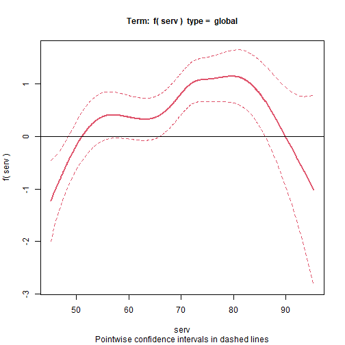
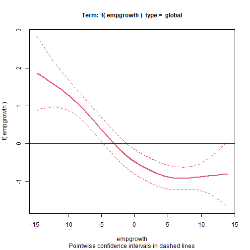
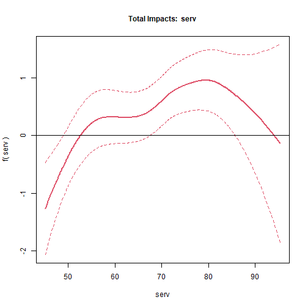
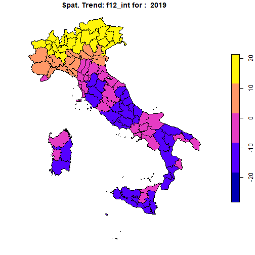

```r
#library(pspatreg)
devtools::load_all()
library(spatialreg)
library(spdep)
library(sf)
library(plm)
library(ggplot2)
library(dplyr)
library(splm)
```

# Models for spatial panel data

This section focuses on the semiparametric P-Spline model for spatial panel data. The model may include a smooth spatio-temporal trend, a spatial lag of dependent and independent variables, a time lag of the dependent variable and of its spatial lag, and a time series autoregressive noise. Specifically, we consider a spatio-temporal ANOVA model, disaggregating the trend into spatial and temporal main effects, as well as second- and third-order interactions between them.

The empirical illustration is based on data on regional unemployment in Italy. This example shows that this model represents a valid alternative to parametric methods aimed at disentangling strong and weak cross-sectional dependence when both spatial and temporal heterogeneity are smoothly distributed [see @minguez2020alternative]. The section is organized as follows:

-   Description of dataset, spatial weights matrix and model specifications;

-   Estimation results of linear spatial models and comparison with the results obtained with **splm**;

-   Estimation results of semiparametric spatial models.

## Dataset, spatial weights matrix and model specifications

The package provides the panel data `unemp_it` (an object of class `data.frame`) and the spatial weights matrix `Wsp_it` (a 103 by 103 square matrix). The raw data - a balanced panel with 103 Italian provinces observed for each year between 1996 and 2019 -  can be transformed in a spatial polygonal dataset of class `sf` after having joined the `data.frame` object with the shapefile of Italian provinces:


```r
data(unemp_it, package = "pspatreg")
unemp_it_sf <- st_as_sf(dplyr::left_join(unemp_it, map_it, by = c("prov" = "COD_PRO")))
```

The matrix `Wsp_it` is a standardized inverse distance W matrix. Using `spdep` we transform it in a list of neighbors object:


```r
lwsp_it <- spdep::mat2listw(Wsp_it)
summary(lwsp_it)
```

```
## Characteristics of weights list object:
## Neighbour list object:
## Number of regions: 103 
## Number of nonzero links: 434 
## Percentage nonzero weights: 4.090866 
## Average number of links: 4.213592 
## Link number distribution:
## 
##  1  2  3  4  5  6  7  8  9 
##  7 20 15 16 17 11 10  6  1 
## 7 least connected regions:
## 32 75 78 80 81 90 92 with 1 link
## 1 most connected region:
## 15 with 9 links
## 
## Weights style: M 
## Weights constants summary:
##     n    nn  S0       S1       S2
## M 103 10609 103 74.35526 431.5459
```

## Linear model (comparison with **splm**)

Using these data, we first estimate fully parametric spatial linear autoregressive panel models using the function `pspatfit()` included in the package **pspatreg** (in the default based on the REML estimator) and compare them with the results obtained using the functions provided by the package **splm** (based on the ML estimator).

### Spatial Lag model (SAR). REML estimates using `pspatfit()`

We consider here a fixed effects specification, including both fixed spatial and time effects:

$$y_{it}=\rho \sum_{j=1}^N w_{ij,N} y_{jt} + \sum_{k=1}^K \beta_k x_{k,it}+ \alpha_i+\theta_t+\epsilon_{it}$$

$$\epsilon_{it} \sim i.i.d.(0,\sigma^2_\epsilon)$$


```r
formlin <- unrate ~ empgrowth + partrate + agri + cons + serv

Linear_WITHIN_sar_REML <- pspatfit(formula = formlin,
                   data = unemp_it, 
                   listw = lwsp_it, 
                   demean = TRUE,
                   eff_demean = "twoways",
                   type = "sar",
                   index = c("prov", "year"))

summary(Linear_WITHIN_sar_REML)
```

```
## 
##  Call 
## pspatfit(formula = formlin, data = unemp_it, listw = lwsp_it, 
##     type = "sar", demean = TRUE, eff_demean = "twoways", index = c("prov", 
##         "year"))
## 
##  Parametric Terms 
##             Estimate Std. Error t value  Pr(>|t|)    
## empgrowth -0.129739   0.014091 -9.2074 < 2.2e-16 ***
## partrate   0.393087   0.023315 16.8595 < 2.2e-16 ***
## agri      -0.036052   0.027267 -1.3222 0.1862167    
## cons      -0.166196   0.044510 -3.7339 0.0001928 ***
## serv       0.012378   0.020597  0.6009 0.5479300    
## rho        0.265671   0.018858 14.0880 < 2.2e-16 ***
## ---
## Signif. codes:  0 '***' 0.001 '**' 0.01 '*' 0.05 '.' 0.1 ' ' 1
## 
##  Goodness-of-Fit 
##  
##  EDF Total:      6 
##  Sigma: 1.86929 
##  AIC:  5396.53 
##  BIC:  5431.41
```

```r
Linear_WITHIN_sar_ML <- spml(formlin,
               data = unemp_it, 
               index=c("prov","year"),
               listw = lwsp_it,
               model="within",
               effect = "twoways",
               spatial.error="none", 
               lag=TRUE, 
               Hess = FALSE)

round(data.frame(Linear_WITHIN_sar_REML = c(Linear_WITHIN_sar_REML$rho, 
                                            Linear_WITHIN_sar_REML$bfixed), 
                Linear_WITHIN_sar_ML = c(Linear_WITHIN_sar_ML$coefficients[1], 
                                         Linear_WITHIN_sar_ML$coefficients[-1])),3)
```

```
##                 Linear_WITHIN_sar_REML Linear_WITHIN_sar_ML
## rho                              0.266                0.266
## fixed_empgrowth                 -0.130               -0.130
## fixed_partrate                   0.393                0.392
## fixed_agri                      -0.036               -0.037
## fixed_cons                      -0.166               -0.167
## fixed_serv                       0.012                0.012
```
Clearly, both methods give exactly the same results, at least at the third digit level.

Extract coefficients:


```r
coef(Linear_WITHIN_sar_REML)
```

```
##         rho   empgrowth    partrate        agri        cons 
##  0.26567078 -0.12973894  0.39308715 -0.03605243 -0.16619608 
##        serv 
##  0.01237770
```

Extract fitted values and residuals:


```r
fits <- fitted(Linear_WITHIN_sar_REML)
resids <- residuals(Linear_WITHIN_sar_REML)
```

Extract log-likelihood and restricted log-likelihhod:


```r
logLik(Linear_WITHIN_sar_REML)
```

```
## 'log Lik.' -2692.266 (df=6)
```

```r
logLik(Linear_WITHIN_sar_REML, REML = TRUE)
```

```
## 'log Lik.' -2711.112 (df=6)
```

Extract the covariance matrix of estimated coefficients. Argument `bayesian` allows to get bayesian (default) or frequentist covariances:


```r
vcov(Linear_WITHIN_sar_REML)
```

```
##               empgrowth      partrate          agri          cons
## empgrowth  1.985464e-04 -8.106848e-05 -3.050359e-06  3.032827e-05
## partrate  -8.106848e-05  5.436097e-04 -7.233434e-05 -1.649890e-04
## agri      -3.050359e-06 -7.233434e-05  7.434641e-04  1.891487e-04
## cons       3.032827e-05 -1.649890e-04  1.891487e-04  1.981149e-03
## serv      -6.861998e-06 -7.891185e-05  2.741340e-04  2.432964e-04
##                    serv
## empgrowth -6.861998e-06
## partrate  -7.891185e-05
## agri       2.741340e-04
## cons       2.432964e-04
## serv       4.242353e-04
```

```r
vcov(Linear_WITHIN_sar_REML, bayesian = FALSE)
```

```
##               empgrowth      partrate          agri          cons
## empgrowth  1.985464e-04 -8.106848e-05 -3.050359e-06  3.032827e-05
## partrate  -8.106848e-05  5.436097e-04 -7.233434e-05 -1.649890e-04
## agri      -3.050359e-06 -7.233434e-05  7.434641e-04  1.891487e-04
## cons       3.032827e-05 -1.649890e-04  1.891487e-04  1.981149e-03
## serv      -6.861998e-06 -7.891185e-05  2.741340e-04  2.432964e-04
##                    serv
## empgrowth -6.861998e-06
## partrate  -7.891185e-05
## agri       2.741340e-04
## cons       2.432964e-04
## serv       4.242353e-04
```

A print method to get printed coefficients, standard errors and p-values of parametric terms:


```r
print(Linear_WITHIN_sar_REML)
```

```
##           Estimate Std. Error t value Pr(>|t|)
## empgrowth  -0.1297     0.0141 -9.2074   0.0000
## partrate    0.3931     0.0233 16.8595   0.0000
## agri       -0.0361     0.0273 -1.3222   0.1862
## cons       -0.1662     0.0445 -3.7339   0.0002
## serv        0.0124     0.0206  0.6009   0.5479
## rho         0.2657     0.0189 14.0880   0.0000
```

```r
summary(Linear_WITHIN_sar_REML)
```

```
## 
##  Call 
## pspatfit(formula = formlin, data = unemp_it, listw = lwsp_it, 
##     type = "sar", demean = TRUE, eff_demean = "twoways", index = c("prov", 
##         "year"))
## 
##  Parametric Terms 
##             Estimate Std. Error t value  Pr(>|t|)    
## empgrowth -0.129739   0.014091 -9.2074 < 2.2e-16 ***
## partrate   0.393087   0.023315 16.8595 < 2.2e-16 ***
## agri      -0.036052   0.027267 -1.3222 0.1862167    
## cons      -0.166196   0.044510 -3.7339 0.0001928 ***
## serv       0.012378   0.020597  0.6009 0.5479300    
## rho        0.265671   0.018858 14.0880 < 2.2e-16 ***
## ---
## Signif. codes:  0 '***' 0.001 '**' 0.01 '*' 0.05 '.' 0.1 ' ' 1
## 
##  Goodness-of-Fit 
##  
##  EDF Total:      6 
##  Sigma: 1.86929 
##  AIC:  5396.53 
##  BIC:  5431.41
```

```r
summary(Linear_WITHIN_sar_ML)
```

```
## Spatial panel fixed effects lag model
##  
## 
## Call:
## spml(formula = formlin, data = unemp_it, index = c("prov", "year"), 
##     listw = lwsp_it, model = "within", effect = "twoways", lag = TRUE, 
##     spatial.error = "none", Hess = FALSE)
## 
## Residuals:
##      Min.   1st Qu.    Median   3rd Qu.      Max. 
## -8.045700 -1.068404 -0.035768  1.014227  7.816307 
## 
## Spatial autoregressive coefficient:
##        Estimate Std. Error t-value  Pr(>|t|)    
## lambda 0.266004   0.020636   12.89 < 2.2e-16 ***
## 
## Coefficients:
##            Estimate Std. Error t-value  Pr(>|t|)    
## empgrowth -0.129530   0.014078 -9.2009 < 2.2e-16 ***
## partrate   0.391597   0.023464 16.6894 < 2.2e-16 ***
## agri      -0.036771   0.027219 -1.3510 0.1767102    
## cons      -0.166896   0.044420 -3.7572 0.0001718 ***
## serv       0.012191   0.020559  0.5930 0.5532105    
## ---
## Signif. codes:  0 '***' 0.001 '**' 0.01 '*' 0.05 '.' 0.1 ' ' 1
```
Computing average direct, indirect and total marginal impacts:


```r
imp_parvar_sar <- impactspar(Linear_WITHIN_sar_REML, listw = lwsp_it)
summary(imp_parvar_sar)
```

```
## 
##  Total Parametric Impacts (sar) 
##            Estimate Std. Error   t value Pr(>|t|)
## empgrowth -0.175364   0.020100 -8.724637   0.0000
## partrate   0.534558   0.032988 16.204584   0.0000
## agri      -0.047202   0.037812 -1.248356   0.2119
## cons      -0.228481   0.058921 -3.877720   0.0001
## serv       0.017354   0.027066  0.641171   0.5214
## 
##  Direct Parametric Impacts (sar) 
##            Estimate Std. Error   t value Pr(>|t|)
## empgrowth -0.131815   0.014742 -8.941567   0.0000
## partrate   0.401828   0.022938 17.518404   0.0000
## agri      -0.035503   0.028408 -1.249771   0.2114
## cons      -0.171776   0.044182 -3.887906   0.0001
## serv       0.013036   0.020332  0.641190   0.5214
## 
##  Indirect Parametric Impacts (sar) 
##             Estimate Std. Error    t value Pr(>|t|)
## empgrowth -0.0435494  0.0062928 -6.9205084   0.0000
## partrate   0.1327297  0.0140779  9.4282579   0.0000
## agri      -0.0116994  0.0094721 -1.2351363   0.2168
## cons      -0.0567047  0.0153916 -3.6841194   0.0002
## serv       0.0043173  0.0067593  0.6387246   0.5230
```


### Spatial error within model (SEM). REML estimates using `pspatfit()`:

$$y_{it}= \sum_{k=1}^K \beta_k x_{k,it}+\alpha_i+\theta_t+ \epsilon_{it}$$

$$\epsilon_{it}=\theta \sum_{j=1}^N w_{ij,N}\epsilon_{it}+u_{it}$$

$$u_{it} \sim i.i.d.(0,\sigma^2_u)$$


```r
Linear_WITHIN_sem_REML <- pspatfit(formlin,
                               data = unemp_it, 
                               demean = TRUE,
                               eff_demean = "twoways",
                               listw = lwsp_it, 
                               index = c("prov", "year"),
                               type = "sem")

Linear_WITHIN_sem_ML <- spml(formlin,
                         data = unemp_it, 
                         index=c("prov","year"),
                         listw = lwsp_it,
                         model="within",
                         effect = "twoways",
                         spatial.error="b", 
                         lag=FALSE, 
                         Hess = FALSE)

round(data.frame(Linear_WITHIN_sem_REML = c(Linear_WITHIN_sem_REML$delta, 
                                            Linear_WITHIN_sem_REML$bfixed), 
                 Linear_WITHIN_sem_ML = c(Linear_WITHIN_sem_ML$spat.coef, 
                                          Linear_WITHIN_sem_ML$coefficients[-1])),3)
```

```
##                 Linear_WITHIN_sem_REML Linear_WITHIN_sem_ML
## delta                            0.283                0.283
## fixed_empgrowth                 -0.134               -0.134
## fixed_partrate                   0.400                0.399
## fixed_agri                      -0.032               -0.033
## fixed_cons                      -0.186               -0.188
## fixed_serv                       0.030                0.031
```


## Semiparametric model without spatial trends

Now, we estimate an additive semiparametric model with three parametric linear terms (for `partrate`, `agri`, and `cons`) and two nonparametric smooth terms (for `serv` and `empgrowth`), but without including any control for spatial and temporal autocorrelation and for the spatio-temporal heterogeneity: $$y_{it}= \sum_{k=1}^K \beta_k z_{k,it} + \sum_{\delta=1}^{\Delta} g_\delta(x_{\delta_{it}}) + \epsilon_{it}$$

$$\epsilon_{it} \sim i.i.d.(0,\sigma^2_\epsilon)$$


```r
formgam <- unrate ~ partrate + agri + cons +
                  pspl(serv, nknots = 15) + 
                  pspl(empgrowth, nknots = 20)

gam <- pspatfit(formgam, data = unemp_it)
summary(gam)
```

```
## 
##  Call 
## pspatfit(formula = formgam, data = unemp_it)
## 
##  Parametric Terms 
##                   Estimate Std. Error  t value  Pr(>|t|)    
## (Intercept)     24.423844   1.095796  22.2887 < 2.2e-16 ***
## partrate        -0.370101   0.017980 -20.5837 < 2.2e-16 ***
## agri             0.346768   0.020121  17.2342 < 2.2e-16 ***
## cons            -0.185432   0.055401  -3.3471 0.0008289 ***
## pspl(serv)       1.921073   0.283973   6.7650 1.660e-11 ***
## pspl(empgrowth) -0.432407   0.088512  -4.8853 1.099e-06 ***
## ---
## Signif. codes:  0 '***' 0.001 '**' 0.01 '*' 0.05 '.' 0.1 ' ' 1
## 
##  Non-Parametric Terms 
##                     EDF
## pspl(serv)      5.4818
## pspl(empgrowth) 0.2496
## 
##  Goodness-of-Fit 
##  
##  EDF Total: 11.7314 
##  Sigma: 4.07483 
##  AIC:  9456.09 
##  BIC:  9524.28
```

The same model, but with a spatial autoregressive term (SAR): $$y_{it}= \rho \sum_{j=1}^N w_{ij,N} y_{jt} +\sum_{k=1}^K \beta_k z_{k,it} + \sum_{\delta=1}^{\Delta} g_\delta(x_{\delta_{it}}) + \epsilon_{it}$$

$$\epsilon_{it} \sim i.i.d.(0,\sigma^2_\epsilon)$$


```r
gamsar <- pspatfit(formgam, data = unemp_it, listw = lwsp_it, method = "eigen", type = "sar")
summary(gamsar)
```

```
## 
##  Call 
## pspatfit(formula = formgam, data = unemp_it, listw = lwsp_it, 
##     type = "sar", method = "eigen")
## 
##  Parametric Terms 
##                   Estimate Std. Error  t value  Pr(>|t|)    
## (Intercept)     10.068382   0.725355  13.8806 < 2.2e-16 ***
## partrate        -0.162431   0.011705 -13.8768 < 2.2e-16 ***
## agri             0.093943   0.013111   7.1651 1.023e-12 ***
## cons            -0.095438   0.036074  -2.6456  0.008207 ** 
## pspl(serv)       0.598250   0.216404   2.7645  0.005743 ** 
## pspl(empgrowth) -0.218982   0.054368  -4.0278 5.802e-05 ***
## rho              0.658979   0.011261  58.5211 < 2.2e-16 ***
## ---
## Signif. codes:  0 '***' 0.001 '**' 0.01 '*' 0.05 '.' 0.1 ' ' 1
## 
##  Non-Parametric Terms 
##                     EDF
## pspl(serv)      6.9167
## pspl(empgrowth) 0.0000
## 
##  Goodness-of-Fit 
##  
##  EDF Total: 13.9168 
##  Sigma: 3.56329 
##  AIC:  7763.26 
##  BIC:  7844.15
```

and a spatial error term: $$y_{it}= \sum_{k=1}^K \beta_k z_{k,it} + \sum_{\delta=1}^{\Delta} g_\delta(x_{\delta_{it}}) + \epsilon_{it}$$

$$\epsilon_{it} = \delta \sum_{j=1}^N w_{ij,N}\epsilon_{it}+u_{it}$$

$$u_{it} \sim i.i.d.(0,\sigma^2_u)$$


```r
gamsem <- pspatfit(formgam, data = unemp_it, listw = lwsp_it, method = "eigen", type = "sem")
```

```
## Error in .solve.checkCond(a, tol) : 
##   'a' is computationally singular, rcond(a)=4.30414e-31
## Error in .solve.checkCond(a, tol) : 
##   'a' is computationally singular, rcond(a)=7.36531e-32
## Error in .solve.checkCond(a, tol) : 
##   'a' is computationally singular, rcond(a)=6.93286e-32
```

```r
summary(gamsem)
```

```
## 
##  Call 
## pspatfit(formula = formgam, data = unemp_it, listw = lwsp_it, 
##     type = "sem", method = "eigen")
## 
##  Parametric Terms 
##                   Estimate Std. Error  t value  Pr(>|t|)    
## (Intercept)     19.397175   1.059863  18.3016 < 2.2e-16 ***
## partrate        -0.217678   0.020990 -10.3704 < 2.2e-16 ***
## agri             0.020614   0.015061   1.3687  0.171223    
## cons            -0.087933   0.039020  -2.2535  0.024314 *  
## pspl(serv)       0.544096   0.269666   2.0177  0.043734 *  
## pspl(empgrowth) -0.142984   0.055169  -2.5917  0.009606 ** 
## delta            0.751250   0.010998  68.3083 < 2.2e-16 ***
## ---
## Signif. codes:  0 '***' 0.001 '**' 0.01 '*' 0.05 '.' 0.1 ' ' 1
## 
##  Non-Parametric Terms 
##                     EDF
## pspl(serv)      9.8356
## pspl(empgrowth) 0.0000
## 
##  Goodness-of-Fit 
##  
##  EDF Total: 16.8356 
##  Sigma: 4.86032 
##  AIC:  8082.93 
##  BIC:  8180.8
```

We can control for spatio-temporal heterogeneity by including a PS-ANOVA spatial trend in 3d. The interaction terms (`f12`,`f1t`,`f2t` and `f12t`) with nested basis. Remark: `nest_sp1`, `nest_sp2` and `nest_time` must be divisors of `nknots`.

$$y_{it}= \sum_{k=1}^K \beta_k z_{k,it} + \sum_{\delta=1}^{\Delta} g_\delta(x_{\delta_{it}}) + 
f_1(s_{1i})+f_2(s_{2i})+f_{\tau}(\tau_t)+ \\ f_{1,2}(s_{1i},s_{2i})+f_{1,\tau}(s_{1i},\tau_t)+f_{2,\tau}+(s_{2i},\tau_t)+f_{1,2,\tau}(s_{1i},s_{2i},\tau_t)+\epsilon_{it}$$

$$\epsilon_{it} \sim i.i.d.(0,\sigma^2_\epsilon)$$


```r
form3d_psanova <- unrate ~ partrate + agri + cons +
                  pspl(serv, nknots = 15) + 
                  pspl(empgrowth, nknots = 20) +
                  pspt(long, lat, year, 
                       nknots = c(18,18,8), psanova = TRUE, 
                       nest_sp1 = c(1, 2, 3), 
                       nest_sp2 = c(1, 2, 3),
                       nest_time = c(1, 2, 2))

sp3danova <- pspatfit(form3d_psanova, data = unemp_it,
                    listw = lwsp_it, method = "Chebyshev")  

summary(sp3danova)
```

```
## 
##  Call 
## pspatfit(formula = form3d_psanova, data = unemp_it, listw = lwsp_it, 
##     method = "Chebyshev")
## 
##  Parametric Terms 
##                    Estimate Std. Error t value  Pr(>|t|)    
## (Intercept)       3.975659   8.445688  0.4707    0.6379    
## partrate          0.149545   0.021941  6.8158 1.197e-11 ***
## agri             -0.020505   0.019754 -1.0380    0.2994    
## cons             -0.038684   0.040441 -0.9566    0.3389    
## f1_main.1        -1.839321  13.263307 -0.1387    0.8897    
## f2_main.1       -15.544083  10.965999 -1.4175    0.1565    
## ft_main.1         2.414483   4.895533  0.4932    0.6219    
## f12_int.1        -8.798610  12.357416 -0.7120    0.4765    
## f1t_int.1         4.110521   6.471417  0.6352    0.5254    
## f2t_int.1        -2.120851   6.780980 -0.3128    0.7545    
## f12t_int.1        1.412301   7.659432  0.1844    0.8537    
## pspl(serv)        0.091533   0.168186  0.5442    0.5863    
## pspl(empgrowth)  -0.287978   0.065553 -4.3931 1.169e-05 ***
## ---
## Signif. codes:  0 '***' 0.001 '**' 0.01 '*' 0.05 '.' 0.1 ' ' 1
## 
##  Non-Parametric Terms 
##                     EDF
## pspl(serv)      5.6815
## pspl(empgrowth) 2.6263
## 
##  Non-Parametric Spatio-Temporal Trend 
##         EDF
## f1   10.667
## f2    9.733
## ft    7.782
## f12  45.424
## f1t   4.239
## f2t  21.473
## f12t 82.111
## 
##  Goodness-of-Fit 
##  
##  EDF Total: 202.737 
##  Sigma: 1.53943 
##  AIC:  5975.89 
##  BIC:  7154.35
```

A semiparametric model with a PS-ANOVA spatial trend in 3d with the exclusion of some ANOVA components


```r
form3d_psanova_restr <- unrate ~ partrate + agri + cons +
                        pspl(serv, nknots = 15) + 
                        pspl(empgrowth, nknots = 20) +
                        pspt(long, lat, year, 
                         nknots = c(18,18,8), psanova = TRUE, 
                         nest_sp1 = c(1, 2, 3), 
                         nest_sp2 = c(1, 2, 3),
                         nest_time = c(1, 2, 2),
                         f1t = FALSE, f2t = FALSE)

sp3danova_restr <- pspatfit(form3d_psanova_restr, data = unemp_it,
                    listw = lwsp_it, method = "Chebyshev")  

summary(sp3danova_restr)
```

```
## 
##  Call 
## pspatfit(formula = form3d_psanova_restr, data = unemp_it, listw = lwsp_it, 
##     method = "Chebyshev")
## 
##  Parametric Terms 
##                    Estimate Std. Error t value  Pr(>|t|)    
## (Intercept)       4.366141   8.446761  0.5169   0.60528    
## partrate          0.150986   0.021906  6.8923 7.089e-12 ***
## agri             -0.027583   0.019676 -1.4018   0.16110    
## cons             -0.022771   0.040534 -0.5618   0.57432    
## f1_main.1        -1.277158  13.265175 -0.0963   0.92331    
## f2_main.1       -15.939808  10.969054 -1.4532   0.14632    
## ft_main.1         4.182334   1.888331  2.2148   0.02687 *  
## f12_int.1        -8.219153  12.404068 -0.6626   0.50764    
## f12t_int.1       14.512194   6.281550  2.3103   0.02096 *  
## pspl(serv)        0.064638   0.162365  0.3981   0.69059    
## pspl(empgrowth)  -0.297971   0.065505 -4.5488 5.680e-06 ***
## ---
## Signif. codes:  0 '***' 0.001 '**' 0.01 '*' 0.05 '.' 0.1 ' ' 1
## 
##  Non-Parametric Terms 
##                     EDF
## pspl(serv)      5.4063
## pspl(empgrowth) 2.6206
## 
##  Non-Parametric Spatio-Temporal Trend 
##          EDF
## f1    10.591
## f2     9.663
## ft     7.765
## f12   45.581
## f1t    0.000
## f2t    0.000
## f12t 114.210
## 
##  Goodness-of-Fit 
##  
##  EDF Total: 206.837 
##  Sigma: 1.5383 
##  AIC:  6019.34 
##  BIC:  7221.64
```

Now we add a spatial lag (*sar*) and temporal correlation in the noise of PSANOVA 3d model.

$$y_{it}= \rho \sum_{j=1}^N w_{ij,N} y_{jt}+\sum_{k=1}^K \beta_k z_{k,it} + \sum_{\delta=1}^{\Delta} g_\delta(x_{\delta_{it}}) + 
f_1(s_{1i})+f_2(s_{2i})+f_{\tau}(\tau_t)+ \\ f_{1,2}(s_{1i},s_{2i})+f_{1,\tau}(s_{1i},\tau_t)+f_{2,\tau}+(s_{2i},\tau_t)+f_{1,2,\tau}(s_{1i},s_{2i},\tau_t)+\epsilon_{it}$$

$$\epsilon_{it} \sim i.i.d.(0,\sigma^2_\epsilon)$$


```r
sp3danovasarar1 <- pspatfit(form3d_psanova_restr, data = unemp_it, 
                              listw = lwsp_it, method = "Chebyshev", 
                              type = "sar", cor = "ar1")  
summary(sp3danovasarar1)
```

```
## 
##  Call 
## pspatfit(formula = form3d_psanova_restr, data = unemp_it, listw = lwsp_it, 
##     type = "sar", method = "Chebyshev", cor = "ar1")
## 
##  Parametric Terms 
##                    Estimate Std. Error t value  Pr(>|t|)    
## (Intercept)       4.027011   7.811451  0.5155   0.60623    
## partrate          0.152078   0.021345  7.1247 1.389e-12 ***
## agri             -0.024655   0.022055 -1.1179   0.26372    
## cons             -0.017631   0.042885 -0.4111   0.68102    
## f1_main.1         0.196195  12.177654  0.0161   0.98715    
## f2_main.1       -12.570282   9.946143 -1.2638   0.20642    
## ft_main.1         1.193027   0.843386  1.4146   0.15733    
## f12_int.1        -5.807022  11.115730 -0.5224   0.60143    
## f12t_int.1        0.502141   2.523234  0.1990   0.84228    
## pspl(serv)        0.180237   0.165103  1.0917   0.27509    
## pspl(empgrowth)  -0.316471   0.053493 -5.9161 3.788e-09 ***
## rho               0.054391   0.021645  2.5128   0.01204 *  
## phi               0.334044   0.013651 24.4705 < 2.2e-16 ***
## ---
## Signif. codes:  0 '***' 0.001 '**' 0.01 '*' 0.05 '.' 0.1 ' ' 1
## 
##  Non-Parametric Terms 
##                     EDF
## pspl(serv)      4.0400
## pspl(empgrowth) 2.4343
## 
##  Non-Parametric Spatio-Temporal Trend 
##         EDF
## f1   10.197
## f2    9.761
## ft    7.879
## f12  42.100
## f1t   0.000
## f2t   0.000
## f12t 79.119
## 
##  Goodness-of-Fit 
##  
##  EDF Total: 167.53 
##  Sigma: 1.62877 
##  AIC:  5495.29 
##  BIC:  6469.11
```

Examples of LR test:


```r
anova(gam, gamsar, lrtest = TRUE)
```

```
##         logLik rlogLik    edf    AIC    BIC LRtest p.val
## gam    -4716.3 -4732.1 11.731 9456.1 9555.7             
## gamsar -3867.7 -3885.9 13.917 7763.3 7880.4 1692.3     0
```

```r
anova(gam, gamsar, lrtest = TRUE)
```

```
##         logLik rlogLik    edf    AIC    BIC LRtest p.val
## gam    -4716.3 -4732.1 11.731 9456.1 9555.7             
## gamsar -3867.7 -3885.9 13.917 7763.3 7880.4 1692.3     0
```

```r
anova(gamsar, gamsem, lrtest = FALSE)
```

```
##         logLik rlogLik    edf    AIC    BIC
## gamsar -3867.7 -3885.9 13.917 7763.3 7880.4
## gamsem -4024.6 -4041.2 16.836 8082.9 8213.7
```

```r
anova(gam, sp3danova_restr, lrtest = TRUE)
```

```
##                  logLik rlogLik     edf    AIC    BIC LRtest p.val
## gam             -4716.3 -4732.1  11.731 9456.1 9555.7             
## sp3danova_restr -2802.8 -2807.8 206.837 6019.3 7213.4 3848.6     0
```

```r
anova(sp3danova_restr, sp3danovasarar1, lrtest = FALSE)
```

```
##                  logLik rlogLik    edf    AIC    BIC
## sp3danova_restr -2802.8 -2807.8 206.84 6019.3 7213.4
## sp3danovasarar1 -2580.1 -2587.3 167.53 5495.3 6471.6
```

Plot of non-parametric terms


```r
list_varnopar <- c("serv", "empgrowth")
terms_nopar <- fit_terms(sp3danova_restr, list_varnopar)
names(terms_nopar)
```

```
## [1] "fitted_terms"           "se_fitted_terms"       
## [3] "fitted_terms_fixed"     "se_fitted_terms_fixed" 
## [5] "fitted_terms_random"    "se_fitted_terms_random"
```

```r
plot_terms(terms_nopar, unemp_it, alpha = 0.05)
```




### Parametric and nonparametric direct, indirect and total impacts


```r
imp_nparvar <- impactspar(sp3danovasarar1, listw = lwsp_it)
summary(imp_nparvar)
```

```
## 
##  Total Parametric Impacts (sar) 
##           Estimate Std. Error   t value Pr(>|t|)
## partrate  0.161421   0.022624  7.135004   0.0000
## agri     -0.025590   0.023074 -1.109062   0.2674
## cons     -0.015641   0.045511 -0.343672   0.7311
## 
##  Direct Parametric Impacts (sar) 
##           Estimate Std. Error   t value Pr(>|t|)
## partrate  0.152727   0.021223  7.196361   0.0000
## agri     -0.024216   0.021834 -1.109105   0.2674
## cons     -0.014781   0.042970 -0.343994   0.7309
## 
##  Indirect Parametric Impacts (sar) 
##             Estimate  Std. Error     t value Pr(>|t|)
## partrate  0.00869470  0.00372253  2.33569690   0.0195
## agri     -0.00137355  0.00142789 -0.96194786   0.3361
## cons     -0.00085948  0.00274455 -0.31315901   0.7542
```


```r
imp_nparvar <- impactsnopar(sp3danovasarar1, listw = lwsp_it, viewplot = TRUE)
```




### Spatial trend 3d (ANOVA).

Plot of spatial trends in 1996, 2005 and 2019


```r
plot_sp3d(sp3danovasarar1, data = unemp_it_sf, 
          time_var = "year", time_index = c(1996, 2005, 2019),
          addmain = FALSE, addint = FALSE)
```


Plot of spatio-temporal trend, main effects and interaction effect for a year:


```r
plot_sp3d(sp3danovasarar1, data = unemp_it_sf, 
          time_var = "year", time_index = c(2019),
          addmain = TRUE, addint = TRUE)
```




Plot of temporal trend for each province:


```r
plot_sptime(sp3danovasarar1, data = unemp_it, 
            time_var = "year", reg_var = "prov")
```


Plots of *fitted* and *residuals* of the last model:


```r
fits <- fitted(sp3danovasarar1)
resids <- residuals(sp3danovasarar1)
plot(fits, unemp_it$unrate)
```


```r
plot(fits, resids)
```


# References
